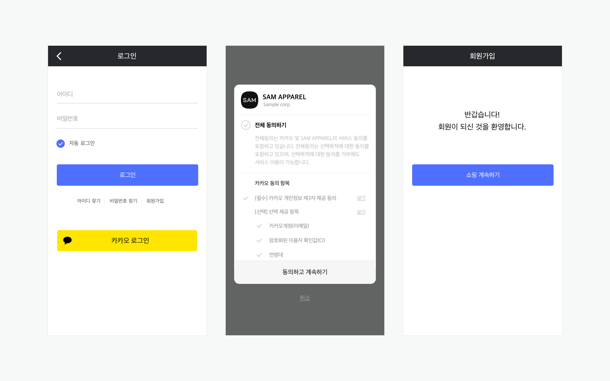
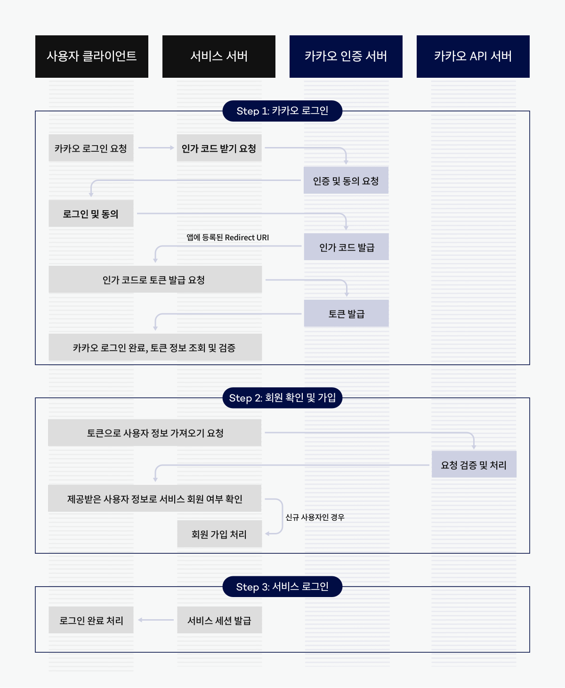

# KaKaO SSO(Single-Sign-On), OAuth

[Kakao Developers](https://developers.kakao.com/docs/latest/ko/kakaologin/common)



# 기능

- 카카오톡 또는 카카오 계정으로 간편한 사용자 로그인
- 사용자 로그인 시 서비스의 카카오톡 채널 추가 유도
- 사용자 고유 식별자 및 인증 정보, 기본적인 사용자 정보인 프로필과 이메일 데이터 제공

## 카카오 로그인

[RFC 6749: The OAuth 2.0 Authorization Framework](https://datatracker.ietf.org/doc/html/rfc6749)

- 카카오 로그인은 OAuth 2.0 기반의 소셜 로그인 서비스
- 사용자가 카카오톡 또는 카카오 계정으로 서비스에 로그인 할 수 있습니다.

### 인증 (Authentication)

- ID 와 비밀번호로 사용자 신원을 확인
- 각 서비스에 사용자가 카카오계정으로 로그인할 수 있는 기능 지원
- 서비스에서 각 사용자를 식별할 수 있는 고유한 회원 번호 제공

참고 : OpenID Connect 지원, 로그인 세션 대신 사용 가능한 ID 토큰 제공 기능

### 인가 (Authorization)

- 사용자 개인정보와 같은 자원(Resource)에 대한 접근 권한 획득
- 사용자 동의를 바탕으로 사용자 정보나 기능에 대한 접근 권한을 토큰 형태로 서비스에 부여

### 토큰(Token)

- 토큰은 사용자의 카카오 로그인 인증 및 인가 정보를 담은 권한 증명으로,  카카오 API 호출에 사용됩니다.
- 카카오 로그인은 OAuth 2.0 표준 규격에 따라 액세스 토큰(Access token), 리프레시 토큰(Refresh token) 두 종류의 토큰을 발급합니다.
- [OpenID Connect](https://developers.kakao.com/docs/latest/ko/kakaologin/common#oidc) 사용 시, 사용자 인증 정보를 담은 ID 토큰을 함께 발급합니다

[스프링부트 강좌 62강(블로그 프로젝트) - 카카오 로그인 환경설정](https://www.youtube.com/watch?v=YtFYSva6MbI&list=PL93mKxaRDidECgjOBjPgI3Dyo8ka6Ilqm&index=64)

### 개발자 센터에서 개발자 등록 한 후 로그인 서비스 신청

[Kakao Developers](https://developers.kakao.com/)



## 내 애플리케이션 에서 앱 만들기

- 이름 및 사업자 명은 마음대로 만들면 된다.

## 앱 키 확인


- 여기서 REST API 키 를 기억해 두자
- 클라이언트 REST API 키 : 1e6e787538b273266b9e8054397aec13

## 로그인 신청

- 왼쪽 탭에서 카카오 로그인에서 OFF 라고 되어 있는 부분은 ON 으로 활성화 시킨다.
- Redirect URI 설정
    - 로그인 페이지 에서 동의하고 계속하기 를 클릭하면 넘어가가지는 URI
    
    
    
    - [http://localhost:8080/auth/kakao/callback](http://localhost:8080/auth/kakao/callback)

## 동의 항목 설정


- 개인정보 중 필요한 것을 성정에서 동의 설정을 한다.
- 카카오계정(이메일) 이나 다른 항목의 경우 필수 동의가 비활성화 되어있는 상태로 카카오 측에서 검수 후에 필수 동의로 바꿀 수 있어 선택 동의로 진행

## 로그아웃 Redirect URI 지정


- 고급에서 Logout Redirect URI 지정할 수 있다.
- 본 프로젝트에서는 데이터 통신만을 위한 것이기 때문에 안드로이드에서 데이터와 전환 처리를 하면 된다.

## 카카오 로그인 화면 이동

> https://kauth.kakao.com/oauth/authorize?response_type=code
> 
> 
> &client_id=${REST_API_KEY}
> 
> &redirect_uri=${REDIRECT_URI}
> 
- 화면 이동한 후 로그인에 성공하면 Code 값이 부여 된 채로 REDIRECT_URI 로 이동하게 된다.

> {REDIRECT_URI}?code={code}
> 
- 이 코드값을 이용해서 token 을 발급받는다

> **POST**
https://kauth.kakao.com/oauth/token
> 


### 응답


- 여기서 필요한 것은 **access_token** 값이다.

## 사용자 정보 가져오기

> **GET/POST**
https://kapi.kakao.com/v2/user/me
> 

## 요청


## 응답


### KakaoAccount

- 응답 목록
    
    
    
    
    
    
    
    
    
    
    
    
    
    
    

### Profile


- 여기서 email 과 profile_image_url, nickname 을 가지고 온다.

---

# 구현

## 웹 API 호출하는 방법

> Spring에서 웹 API 호출을 위한 주요 라이브러리와 도구는 다음과 같습니다:
> 
> 1. **RestTemplate**: Spring에서 제공하는 HTTP 클라이언트 라이브러리로, 간단하고 편리한 방식으로 웹 API를 호출할 수 있습니다.
> 2. **WebClient**: Spring 5부터 소개된 비동기 및 함수형 방식의 HTTP 클라이언트 라이브러리로, 더욱 높은 성능과 유연성을 제공합니다.
> 3. **OkHttp**: Square사에서 제공하는 높은 성능을 가진 HTTP 클라이언트 라이브러리입니다. Spring과 통합하여 사용할 수 있습니다.
> 4. **Feign**: Netflix에서 개발한 라이브러리로, 선언적으로 HTTP API 클라이언트를 정의하고 이를 사용하여 RESTful 서비스를 호출할 수 있습니다.
> 5. **Retrofit**: Square사에서 제공하는 라이브러리로, REST API 클라이언트를 빌드하는 데 사용됩니다. Spring과 통합하여 사용할 수 있습니다.
> 6. **Apache HttpClient**: Apache 소프트웨어 재단에서 개발한 HTTP 클라이언트 라이브러리로, Spring과 함께 사용할 수 있습니다.
> 7. **Unirest**: 미리 정의된 메서드를 사용하여 간단한 HTTP 요청을 생성하는 라이브러리로, RESTful API 호출을 단순화합니다.

```jsx
String callbackUrl = "http://localhost:8080/auth/kakao/callback";
		String codeUrl = "https://kauth.kakao.com/oauth/token";

		RestTemplate rt = new RestTemplate();
		HttpHeaders headers = new HttpHeaders();
		headers.add("Content-type", "application/x-www-form-urlencoded;charset=utf-8");

		MultiValueMap<String, String> params = new LinkedMultiValueMap<>();
		params.add("grant_type" , "authorization_code");
		params.add("client_id" , "1e6e787538b273266b9e8054397aec13");
		params.add("redirect_uri",callbackUrl);
		params.add("code",code);

		HttpEntity<MultiValueMap<String, String>> kakaoTokenRequest =
			new HttpEntity<>(params,headers);

		ResponseEntity<String> response = rt.exchange(
			codeUrl
			, HttpMethod.POST
			,kakaoTokenRequest
			,String.class
		);
```

- HttpEntity ← header 와 params 입력
- RestTemplate 로 요청 받는 형식으로 변환 (url, {GET/POST/PUT/DELETE} , request, String.class)
- ResponseEntity 로 RestTemplate 에서 변환 시켜준 것을 저장
- 바로 String 형식으로 확인하는 방법

```jsx
response.getBody()
```

## ResponseEntity 를 객체에 삽입하는 법(Json → java.class)

## JSON 을 보기 쉽게 변환하는 방법

---

### JSON Viewer

[JSON Viewer](https://chrome.google.com/webstore/detail/json-viewer/gbmdgpbipfallnflgajpaliibnhdgobh?hl=ko)

- 크롬 웹 스토어에서 설정 하면 웹에서 Json 형식을 보기 좋게 바꾸어 준다.

### JSON Parser

[Json Parser Online](http://json.parser.online.fr/)

- 인터넷 상에서 빠르게 볼 수 있는 사이트이다.

## Json → Java.class 로 바꿔주는 기능

## JsonSchema2POJO

[jsonschema2pojo](https://www.jsonschema2pojo.org/)

- 인터넷 상의 파일을 바로 바꾸어 주는 사이트

### JsonToJava


- IntelliJ 에 있는 플러그인으로 입력하면 바로 그에 맞는 Java Class 를 만들어 준다.
    
    
    
- Json 을 입력 해 주고 엔티티 이름을 만들어 주면 그에 연관된 class 또한 모두 만들어 준다.
    
    
    

## 구현

- Gson, Json, Simple, ObjectMapper 라이브러리 사용 가능

```jsx
//Gson , Json, Simple, Object Mapper
		ObjectMapper objectMapper = new ObjectMapper();
		KakaoOauthToken kakaoOauthToken =null;
		try {
			kakaoOauthToken = objectMapper.readValue(response.getBody(),KakaoOauthToken.class);
		} catch (JsonProcessingException e) {
			e.printStackTrace();
		}

return kakaoOauthToken;
```

- ObjectMapper.reaValue : 는 없을 수도 있기 때문에 예외 처리를 하라는 알림이 뜬다.
- 또한 받을 객체를 바깥으로 빼어서 그 이후 return 값에 직접적으로 바로 넣을 수 있게 한다.

## Json → Class

### Json 이름 그대로 매핑

```jsx
@Data
public class KakaoOauthToken {
	private String access_token;
	private String token_type;
	private String refresh_token;
	private int expires_in;
	private int refresh_token_expires_in;
	private String scope;

}
```

### 이름 컨벤션에 의해서 바꿔서 매핑

```jsx
@Data
public class KakaoInfo {
	@JsonProperty("id")
	private Long id;

	@JsonProperty("connected_at")
	private String connectedAt;

	@JsonProperty("properties")
	private KakaoProperties kakaoProperties;

	@JsonProperty("kakao_account")
	private KakaoAccount kakaoAccount;
}
```

### DTO 설정 및 Builder 패턴 삽입

```jsx
@Builder
	public KakaoDto(String email, String name, String profileUrl) {
		this.email = email;
		this.name = name;
		this.profileUrl = profileUrl;
	}
```

### ResponseBody 로 Dto 전달

```jsx
@ResponseBody
	@GetMapping("/auth/kakao/{accessToken}")
	public KakaoDto findKakaoInfo(@PathVariable String accessToken){

		KakaoInfo profile = kakaoLoginService.findKakaoInfo(accessToken);

		KakaoDto profileDto = kakaoLoginService.sendKakaoDto(profile);

//sendKakaoDto 로 kakaoInfo -> kakaoDto 로 변환
	public KakaoDto sendKakaoDto(KakaoInfo kakaoInfo){
	
			KakaoDto kakaoDto = KakaoDto.builder()
				.email(kakaoInfo.getKakaoAccount().getEmail())
				.name(kakaoInfo.getKakaoAccount().getKakaoProfile().getNickname())
				.profileUrl(kakaoInfo.getKakaoAccount().getKakaoProfile().getProfileImageUrl())
				.build();
	
			return kakaoDto;
		}

		return profileDto;
	}
```

## 실행 결과


# 토큰 갱신하기 (RefreshToken)


